# Orba Agency

Website institucional fictício desenvolvido para uma agência de **Publicidade e Propaganda**, com foco em design moderno, responsividade e boas práticas de front-end.
Este projeto foi desenvolvido como parte do meu portfólio para demonstrar habilidades em **desenvolvimento web e interface de usuário**.

---

## 📸 Screenshots

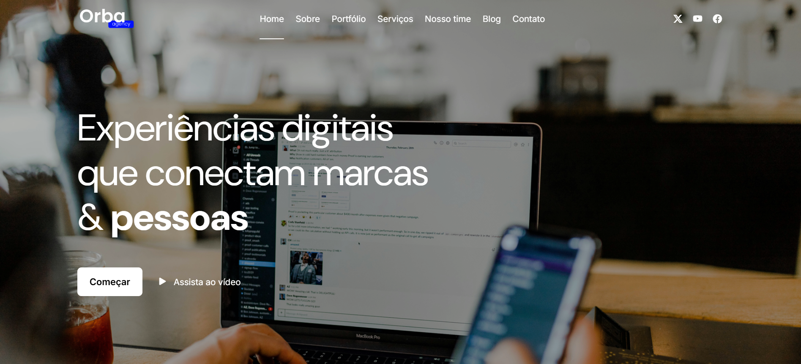
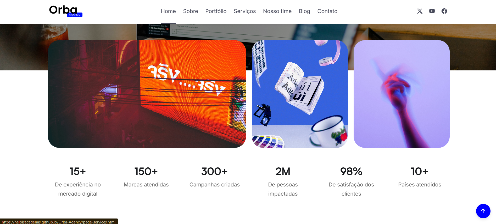
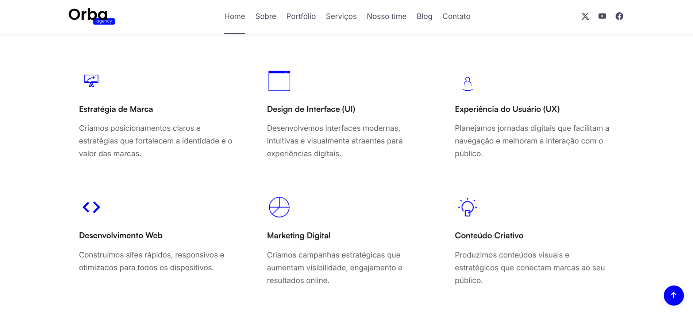
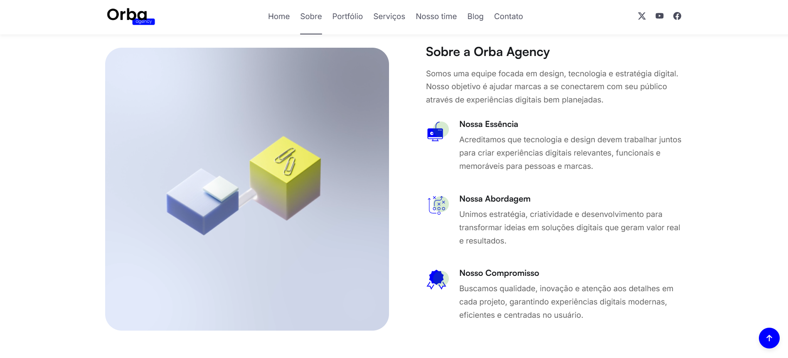
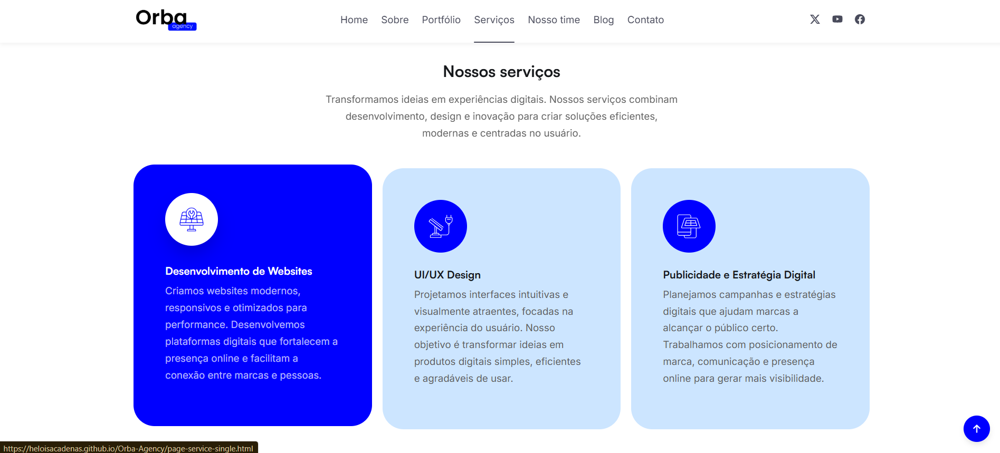
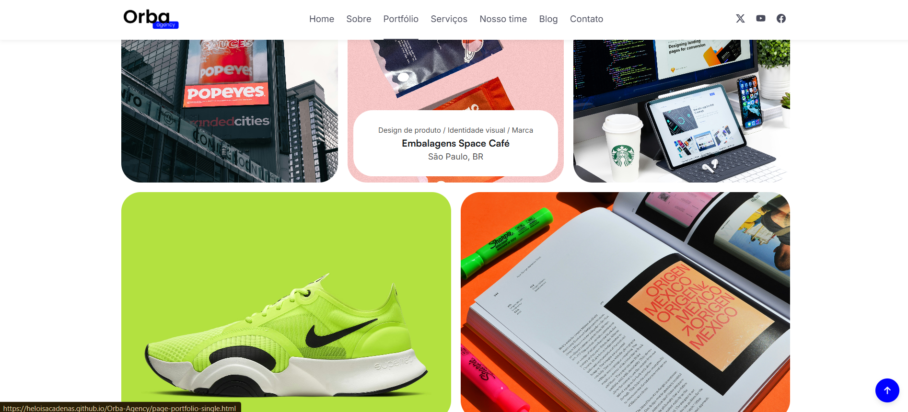
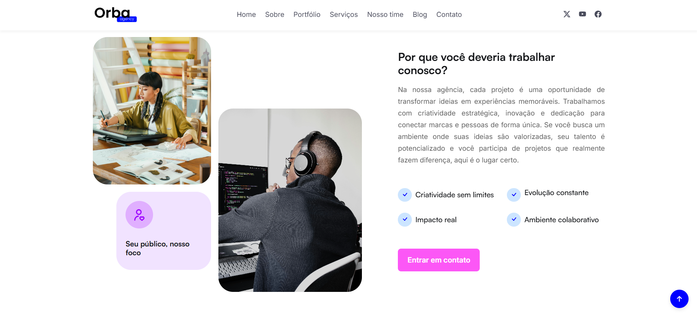
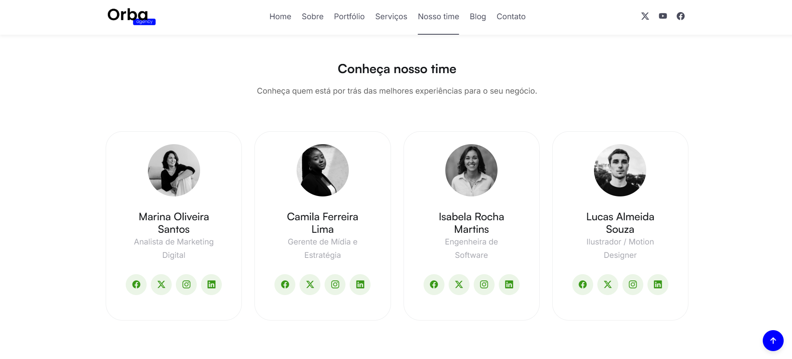
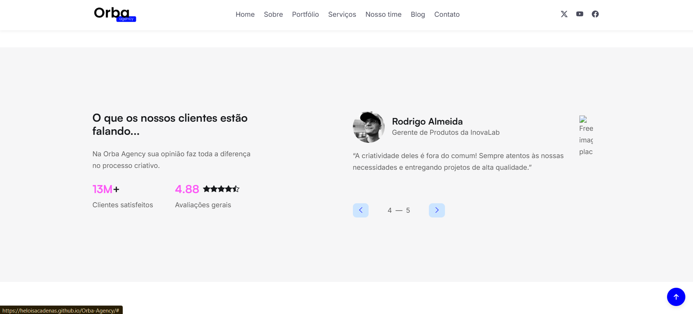
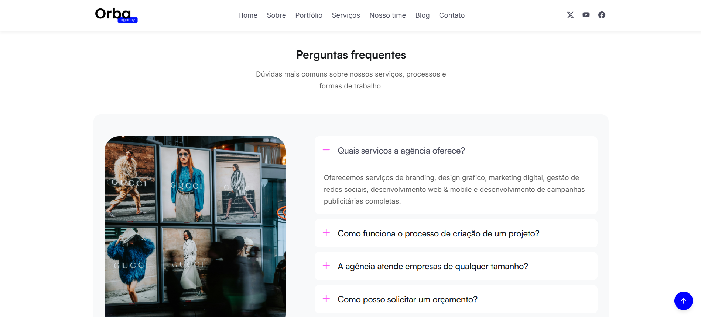
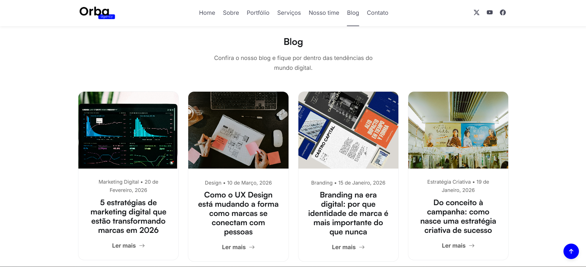
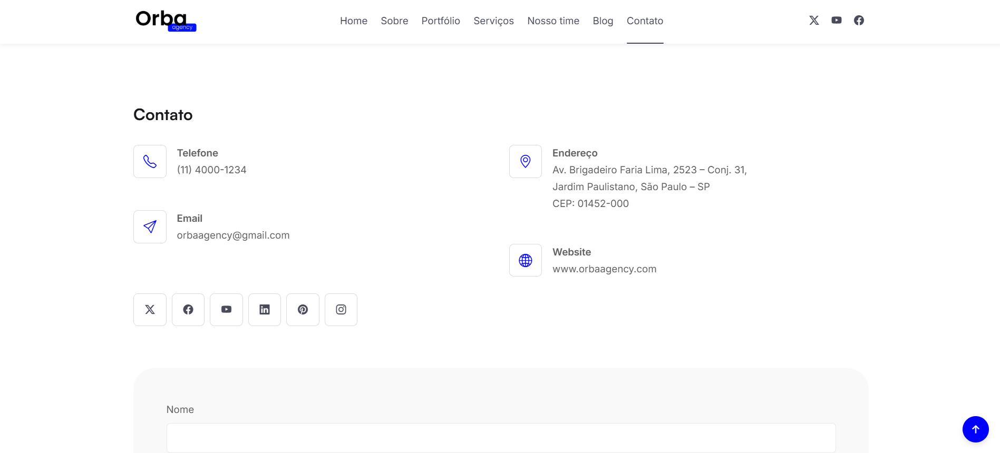
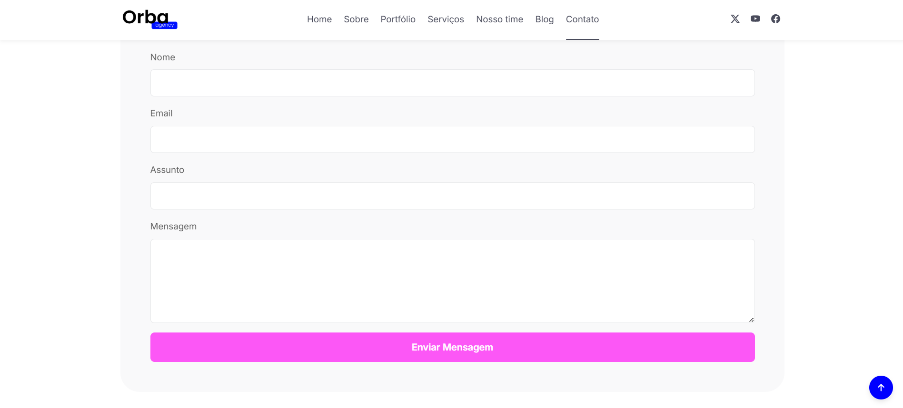
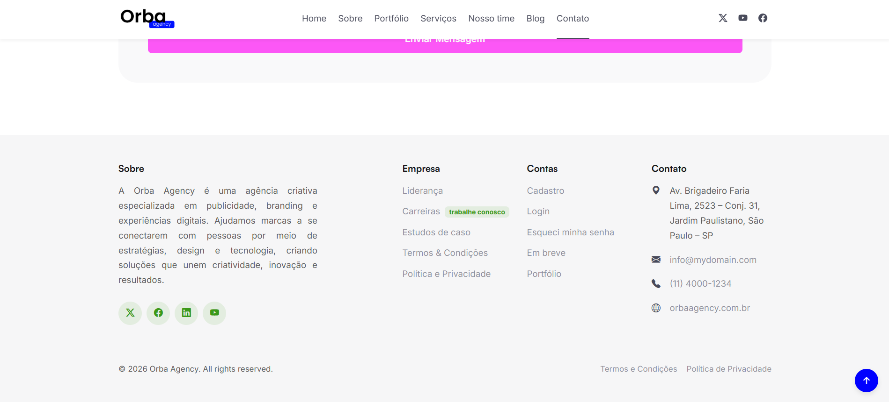

---

## 🌐 Demo

🔗 https://heloisacadenas.github.io/Orba-Agency/

---

## ✨ Funcionalidades

- Landing page moderna
- Seção de serviços
- Portfólio de projetos
- Apresentação do time
- Blog da agência
- FAQ interativo
- Seção de contato
- Vídeo institucional
- Design responsivo para diferentes dispositivos
- Animações suaves na interface

---

## 🛠️ Tecnologias utilizadas

- **HTML5**
- **CSS3**
- **JavaScript**
- **Bootstrap**
- **Figma**
- **Photoshop**
- **Canva**

---

## 🎯 Objetivo do projeto

Este projeto foi criado com o objetivo de praticar e demonstrar habilidades em:

- Estruturação de páginas web
- Componentização de layout
- Boas práticas de organização de arquivos
- Desenvolvimento de interfaces modernas
- Utilização de frameworks
- Desenvolvimento responsivo
- Desenvolvimento para empresas

---

## 👩‍💻 Autora

**Heloisa Cadenas**

🎓 Estudante de Engenharia de Software  
💻 Técnica em Informática para Internet  

🔗 GitHub  
https://github.com/heloisacadenas

---

⭐ Se este projeto te interessou, fique à vontade para explorar o código!
